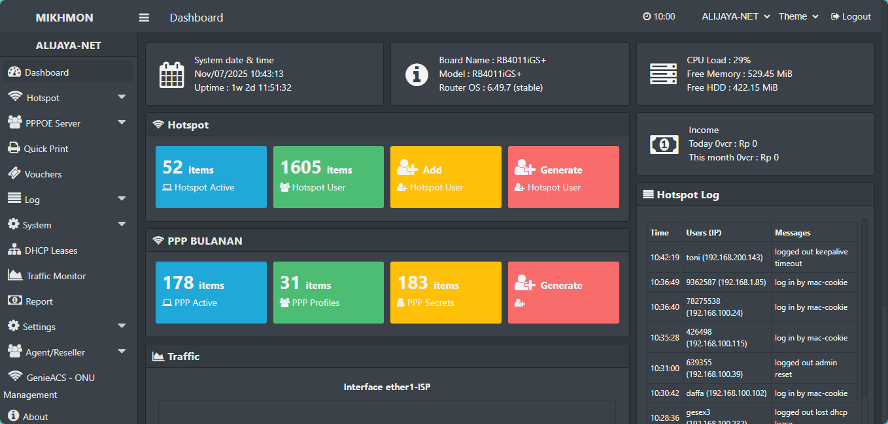
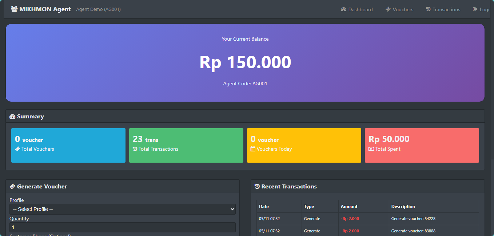
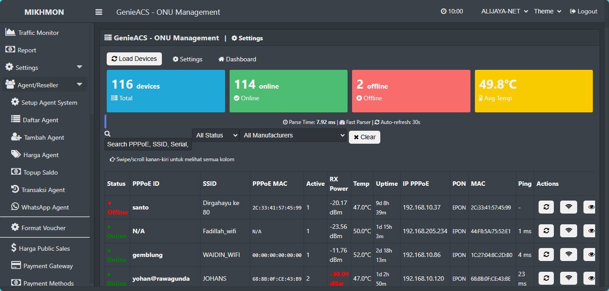
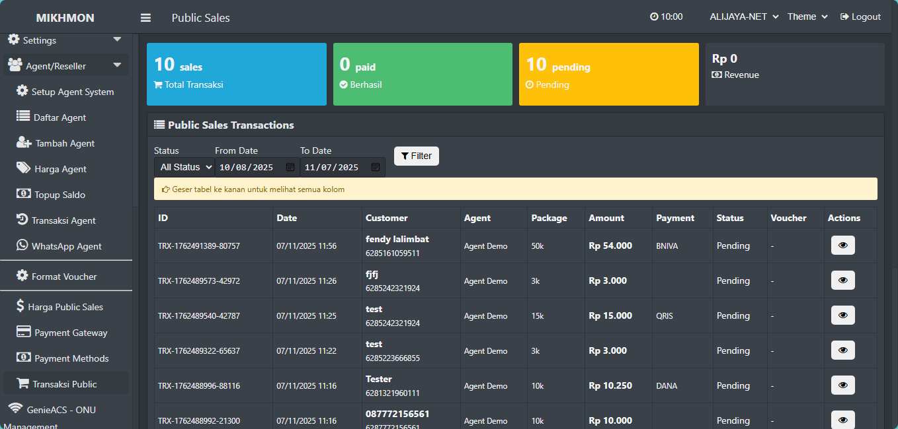
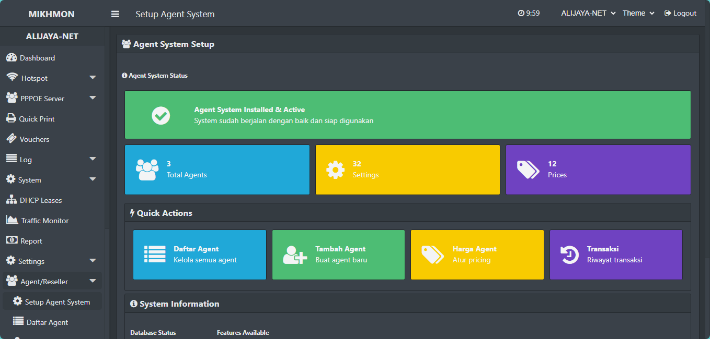
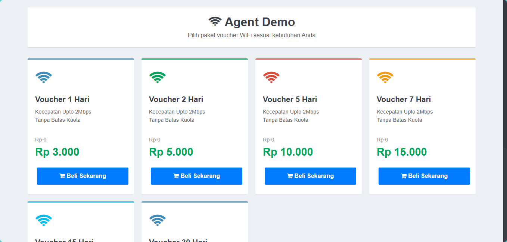
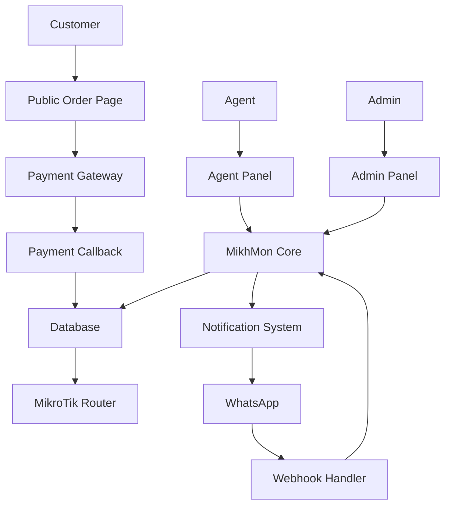

# 🚀 MikhMon Agent System

[](https://www.php.net/)
[](LICENSE)
[](https://github.com/alijayanet/mikhmon-agent/stargazers)

**Sistem Penjualan Voucher WiFi Otomatis untuk MikroTik Hotspot dengan Fitur Agent/Reseller, Payment Gateway, dan WhatsApp Integration**

---


## 📸 Screenshot

### Dashboard Agent

*Dashboard agent dengan ringkasan saldo dan statistik*

### Generate Voucher

*Form generate voucher dengan preview modern*

### Dasboard Genieacs

*Monitoring Genieacs*

### Voucher Preview

*Preview laporan penjualan Voucher Online*

### Admin Panel

*Panel administrasi untuk manajemen agen dan harga*

### Public Order Page

*Landing page untuk pembelian langsung oleh customer link :https://yourdomain.com/public/index.php?agent=AG001*

## 📖 Tentang Proyek

MikhMon Agent System adalah solusi komprehensif untuk manajemen penjualan voucher WiFi berbasis MikroTik Hotspot dengan sistem agen/reseller. Sistem ini memungkinkan pemilik hotspot untuk menjual voucher melalui agen-agen mereka, menerima pembayaran otomatis, dan mengelola seluruh operasional melalui antarmuka yang intuitif.

Proyek ini merupakan pengembangan lanjutan dari [MikhMon V3](https://github.com/laksa19/mikhmonv3) dengan penambahan fitur-fitur bisnis yang lengkap.

## 🌟 Fitur Utama

### 🤝 Sistem Agent/Reseller
- Multi-level agent dengan pengaturan harga khusus
- Manajemen saldo dan transaksi agen
- Sistem komisi otomatis
- Topup saldo melalui berbagai metode pembayaran

### 💳 Payment Gateway Integration
- Integrasi dengan 12+ metode pembayaran (QRIS, Virtual Account, E-Wallet)
- Support Tripay, Xendit, dan gateway lainnya
- Manajemen transaksi otomatis
- Notifikasi pembayaran real-time

### 📱 WhatsApp Integration
- Webhook commands untuk customer dan agent
- Notifikasi otomatis via WhatsApp
- Sistem broadcast pesan
- Customer service bot

### 🎟️ Manajemen Voucher
- Generate voucher otomatis
- Template voucher yang dapat dikustomisasi
- Print voucher (thermal & normal)
- Tracking status voucher (active, used, expired)

### 📊 Dashboard & Reporting
- Dashboard real-time untuk agent
- Laporan penjualan harian/mingguan/bulanan
- Statistik performa agen
- Export data ke berbagai format

### 🔧 Fitur Teknis
- Responsive design (mobile-friendly)
- RESTful API untuk integrasi
- Multi-session MikroTik
- One-click installation
- Auto-fix compatibility issues

## 🏗️ Arsitektur Sistem



### Komponen Utama:
1. **Frontend Public** - Landing page untuk pembelian langsung
2. **Agent Panel** - Dashboard untuk agen/reseller
3. **Admin Panel** - Kontrol penuh untuk administrator
4. **API Layer** - RESTful API untuk integrasi
5. **Payment Gateway** - Integrasi pembayaran otomatis
6. **WhatsApp Integration** - Bot dan notifikasi WhatsApp
7. **Database Layer** - MySQL dengan struktur teroptimasi

## 🚀 Instalasi

### Prasyarat
- PHP 7.4 atau lebih tinggi
- MySQL 5.7+ atau MariaDB 10.2+
- Web Server (Apache/Nginx)
- MikroTik RouterOS

### Instalasi Cepat (4 Langkah)

1. **Upload Files**
   ```bash
   git clone https://github.com/alijayanet/mikhmon-agent.git
   ```

2. **Buat Database**
   ```sql
   CREATE DATABASE mikhmon_agents CHARACTER SET utf8mb4 COLLATE utf8mb4_unicode_ci;
   ```

3. **Konfigurasi Database**
   Edit file `include/db_config.php`:
   ```php
   define('DB_HOST', 'localhost');
   define('DB_USER', 'your_db_user');
   define('DB_PASS', 'your_db_password');
   define('DB_NAME', 'mikhmon_agents');
   ```

4. **Run Installer**
   Akses `https://yourdomain/fix_all_database_issues.php?key=mikhmon-fix-2024

### Konfigurasi Tambahan

#### WhatsApp Integration
1. Setup webhook di gateway WhatsApp (Fonnte/Wablas/WooWA)
2. Konfigurasi di `settings/whatsapp_settings.php`
3. Hubungkan nomor dengan scan QR code

#### Payment Gateway
1. Daftar di Tripay/Xendit/Duitku
2. Dapatkan API keys
3. Konfigurasi di `agent-admin/payment_gateway_config.php`

## 🛠️ Teknologi yang Digunakan

- **Backend**: PHP 7.4+, MySQL/MariaDB
- **Frontend**: HTML5, CSS3, JavaScript, Bootstrap 4
- **Router Integration**: MikroTik RouterOS API
- **Payment**: Tripay, Xendit, Duitku API
- **Messaging**: WhatsApp Webhook Integration
- **Charting**: Highcharts
- **QR Code**: Google Charts API
- **UI Framework**: Custom MikhMon UI

## 🤝 Kontribusi

Kontribusi sangat kami nantikan! Untuk berkontribusi:

1. Fork proyek ini
2. Buat branch fitur (`git checkout -b feature/AmazingFeature`)
3. Commit perubahan (`git commit -m 'Add some AmazingFeature'`)
4. Push ke branch (`git push origin feature/AmazingFeature`)
5. Buka Pull Request

### Panduan Kontribusi
- Ikuti standar penulisan kode PHP PSR-12
- Tambahkan komentar kode yang jelas
- Uji perubahan sebelum submit
- Perbarui dokumentasi jika diperlukan

## 📄 Lisensi

Distributed under the MIT License. See [LICENSE](LICENSE) for more information.

## 📞 Kontak

**Ali Jaya Net** - [@alijayanet](https://github.com/alijayanet)

Project Link: [https://github.com/alijayanet/mikhmon-agent](https://github.com/alijayanet/mikhmon-agent)

## 🙏 Acknowledgements

- [MikhMon V3](https://github.com/laksa19/mikhmonv3) - Base system
- [RouterOS API](https://wiki.mikrotik.com/wiki/Manual:API) - MikroTik integration
- [Font Awesome](https://fontawesome.com/) - Icons
- [Bootstrap](https://getbootstrap.com/) - CSS Framework
- [Highcharts](https://www.highcharts.com/) - Charting library

---

<p align="center">
  Made with ❤️ by Ali Jaya Net

</p>


